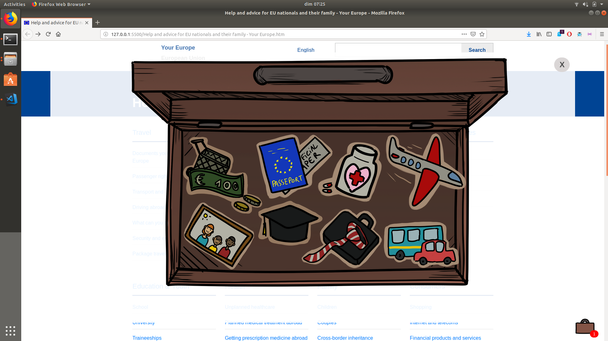

# Unlocking the GateWay: Hackathon in Brussels

* Participation au Hackathon organisé par la Commission Européenne pour le projet *Single Digital Gateway* (SDG)
* Le but était de concevoir un outil de *reporting* permettant aux utilisateurs de la plateforme de donner leurs feedback
* Le projet n'a pas remporté de prix mais nous a appris énormément de choses à propos de l'organisation du travail en équipe et du monde du hackathon en général
* Notre idée était de proposer un outil regroupant les besoins d'un voyageur dans un même endroit (une valise) et, quand le voyageur a un problème, lui laisser l'option de reporter son problème à l'administrateur du site. L'intérêt est que le voyageur peut également cocher ce qui a bien fonctionné pour lui
* Le projet ne sera plus modifié à l'avenir

## Vidéo de présentation du projet SDG
https://www.youtube.com/watch?v=Znkoz0-P3sc

## Équipe ayant élaboré le projet

* Antoine Diambu ([GitHub](https://github.com/AntoineDia)) 

    * Back-End : PHP, SQL, DataBase
    * Fonctionnement des outils (Interactivité) : Javascript
* Gaëlle Gaban ([GitHub](https://github.com/Gaellga))
    * Design : élaboration des éléments visuels
    * Front-End/Interactivité : CSS, Javascript
* Mona Marchetti ([GitHub](https://github.com/MonaMarchetti))
    * Gestion du projet : Design Thinking, Idea Maker
    * Communication/Marketing : élaboration du pitch et de son support visuel
* Teddy Wauquier ([GitHub](https://github.com/Elleonors))
    * Front-End : Bootstrap
    * Communication/Marketing : Pitch Speaker

## Technologies utilisées 

* HTML5
* CSS
* Javascript  
* PHP
* SQL

## Framework, librairies, serveurs
* Bootstrap
* PHPMyAdmin

## Utilisation de l'outil 
* Sur la page principale, rendez-vous sur l'onglet **Security and emergencies** (le site n'étant pas réellement un site, c'est la seule page qui renverra à quelque chose)
* La valise en bas à droite aura alors une nouvelle notification : double-cliquez dessus
* Sur l'interface de choix de destination (le choix est indisponible), continuez sur **GO**
* Passez votre souris sur les différentes icônes pour explorer les fonctionnalités de l'outil !

## Credits
* L'architecture du site est récupérée entièrement du site de [YourEurope](https://europa.eu/youreurope/citizens/index_en.htm)
* Les images ont été créées lors de l'évènement et nous appartiennent

  
### Vous pouvez accéder au projet via [ce lien]() ou retourner à [son repository](https://github.com/Gaellga/Unlocking-the-Gateway-Hackathon)
